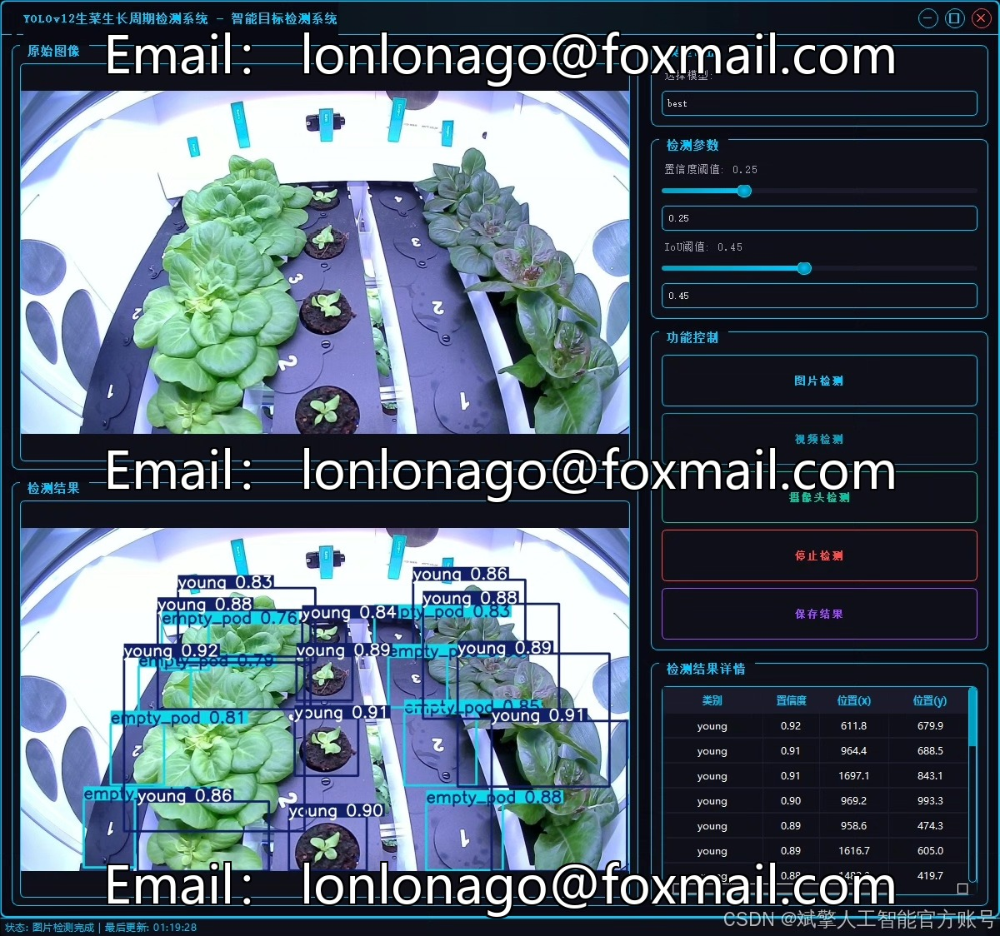
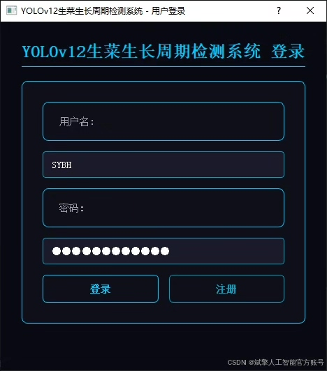
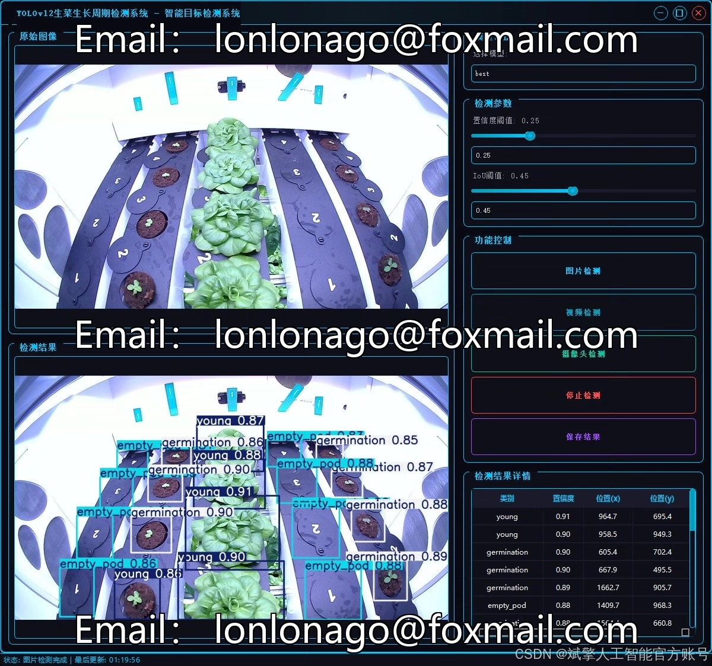
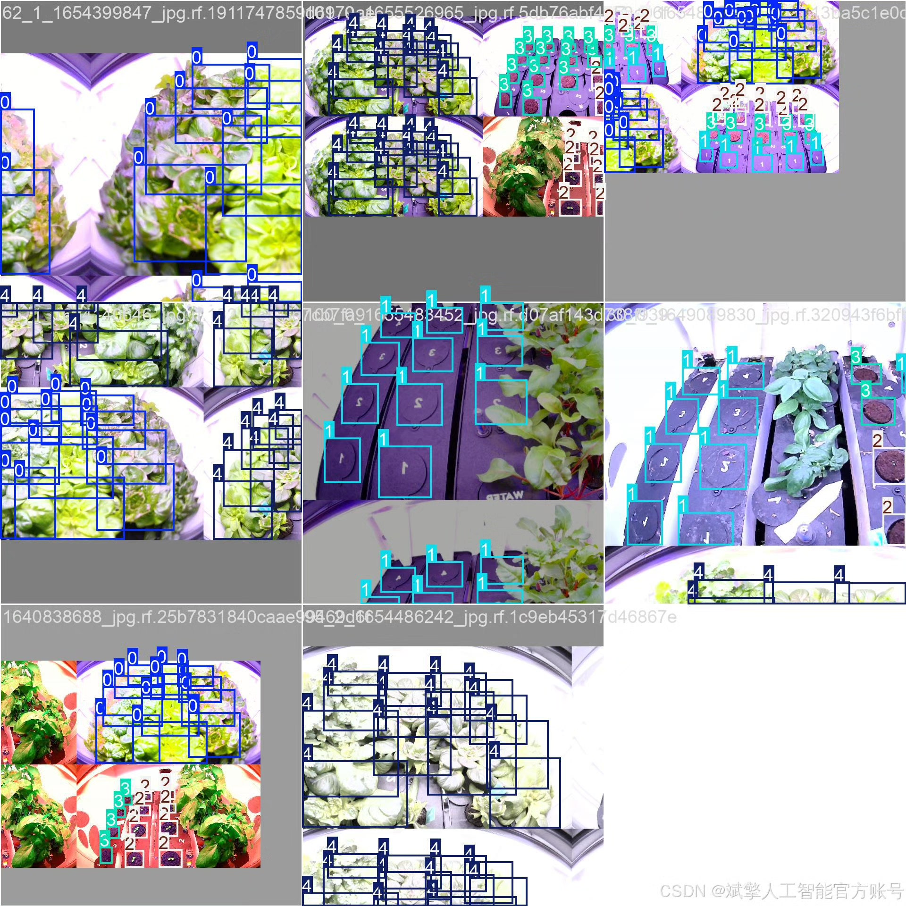
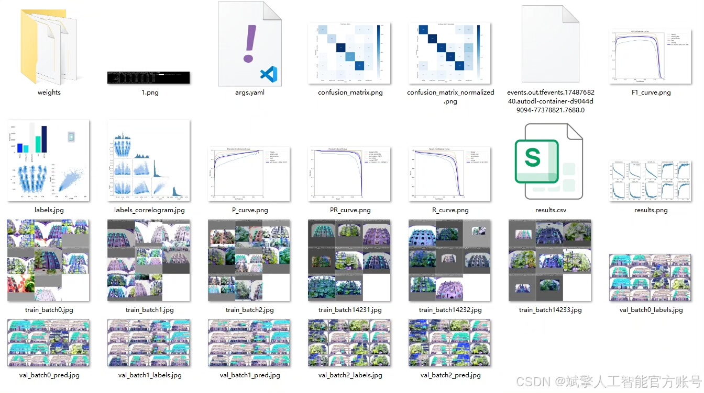
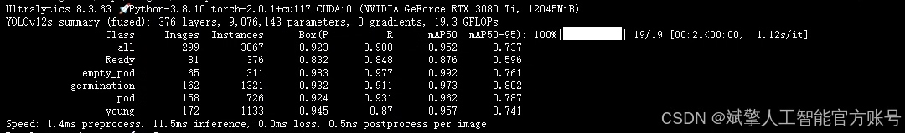
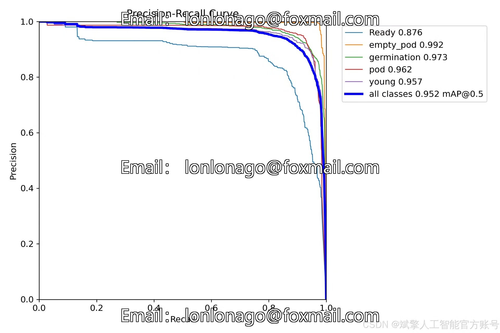
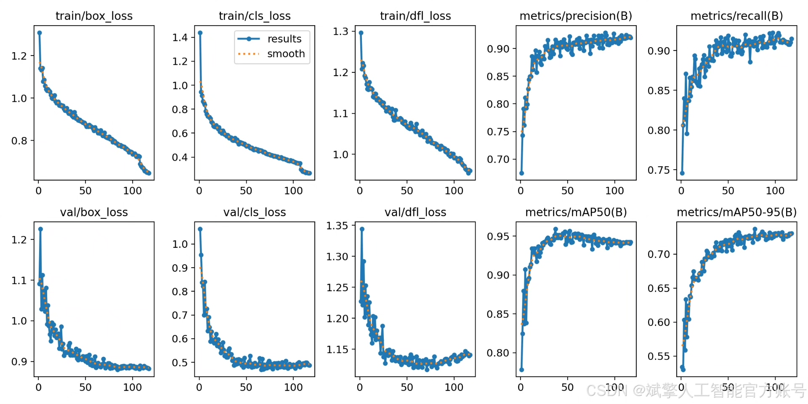
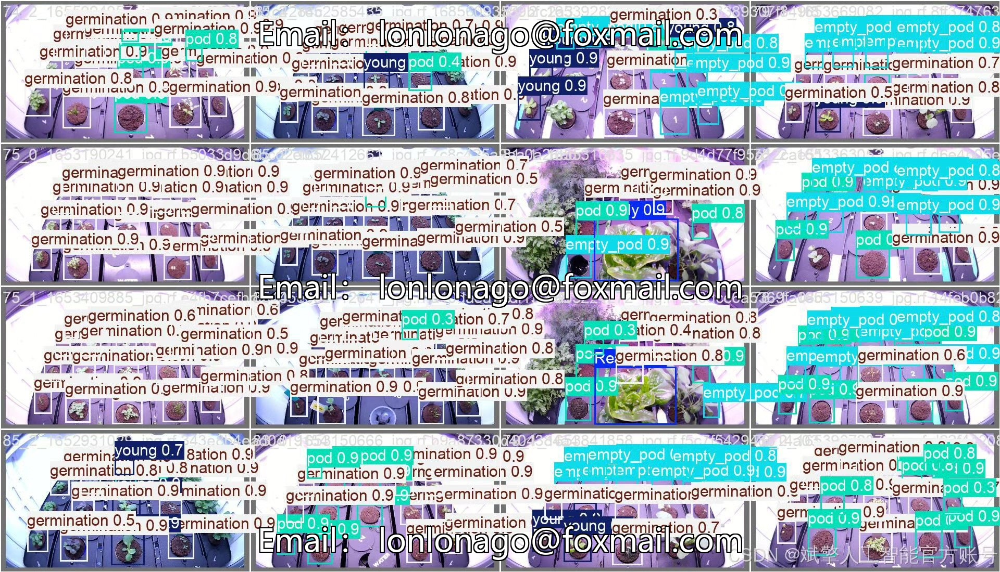

# YOLOv12 Vegetable Growth Detection System

## Body

YOLOv12 Vegetable Growth Detection System Based on Deep Learning YOLOv12: A Vegetable Growth Cycle Detection System (YOLOv12+YOLO dataset + UI interface + login registration interface + Python project source code + model)

This paper proposes a system based on deep learning YOLOv12 for the detection of different growth stages of lettuce. The system employs the YOLOv12 object detection algorithm, combined with a customized YOLO dataset, to achieve precise detection of the growth cycle of lettuce, including five categories: 'Ready' (ripe), 'empty_pod' (empty planting tray), 'germination' (germination period), 'pod' (planting tray), and 'young' (young seedling). The system is equipped with a user-friendly UI interface that supports login registration functions, facilitating multi-user management. The project provides complete Python source code, pre-trained models, and datasets, which can serve as research and application tools in fields such as smart agriculture and plant factories. Experimental results show that the system performs well on the test set, with an accuracy rate exceeding 90%, demonstrating high practicality and scalability.

Dataset:
nc: 5 classes,
name: ['Ready', 'empty_pod', 'germination', 'pod', 'young'],
dataset quantity: training set 1060, validation set 299, test set 151.

✅ User login registration: Supports password verification and security validation.
✅ Three detection modes: Based on the YOLOv12 model, supporting image, video, and real-time camera detection, accurately identifying targets.
✅ Dual-screen comparison: Displaying original images and detection results simultaneously on the screen.
✅ Data visualization: Real-time table displaying the category, confidence, and coordinates of detected targets.
✅ Intelligent parameter adjustment: Providing a confidence slide bar to dynamically optimize detection accuracy, adapting to different scene requirements.
✅ Sci-fi style interactive interface: Dark theme paired with dynamic light effects, reducing visual fatigue and improving operational experience.

## Images

## Payment

Here is a pay link on Stripe ( https://buy.stripe.com/3cs8yP7sY87d0vu9AB ). Please contact me lonlonago@foxmail.com after funding $89, and I will send you a complete data files , thank you!

